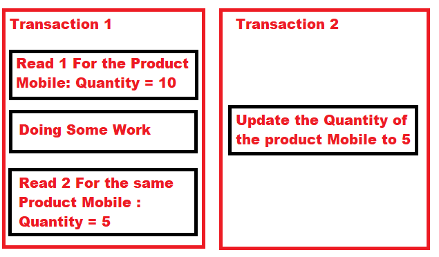
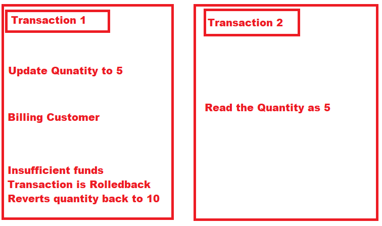

###### What Is a Transaction?

In programming, we refer to a transaction as **a group of related actions that need to be performed as a single action**. In other words, a transaction is a logical unit of work whose effect is visible outside the transaction either in its entirety or not at all. We require this to ensure data integrity in our applications.

**ACID** [atomicity](https://en.wikipedia.org/wiki/Atomicity_(database_systems)), [consistency](https://en.wikipedia.org/wiki/Consistency_(database_systems)), [isolation](https://en.wikipedia.org/wiki/Isolation_(database_systems)), [durability](https://en.wikipedia.org/wiki/Durability_(database_systems)) is a set of properties of [database transactions](https://en.wikipedia.org/wiki/Database_transaction "Database transaction") intended to guarantee data validity despite errors, power failures, and other mishaps.

---

Transaction isolation levels:

- Serializable => no data consistency risk, however the lowest performance is present
- Repeatable reads => phantom reads
- Read committed => non-repeatable reads
- Read uncommitted => Dirty reads

**Serializable:** This is the highest level of isolation, where transactions are completely
isolated from each other and executed serially. This eliminates all anomalies
but can also result in lower concurrency and longer transaction times.

**Repeatable Read:** This level guarantees that a transaction will always see the same
data during the transaction, regardless of changes made by other transactions.
This eliminates non-repeatable reads, but can still result in phantom reads,
where a transaction reads rows that were inserted or deleted by other transactions.

**Phantom reads example:**

**Read Committed:** In this isolation level, a transaction can only read data that has been
committed by other transactions. This eliminates dirty reads, but can still result
in non-repeatable reads, where a transaction reads the same row multiple times and gets different values.

**Non-repeatable reads example:**

**Read Uncommitted:** This is the lowest level of isolation, where a transaction can
read data that has been modified by another transaction but not yet committed.
This can result in dirty reads, where a transaction reads data that is later rolled back.

**Dirty reads example:**

